# Kubernetes and Cloud Architecture Mermaid Diagrams

This document contains Mermaid diagrams for the Cloud Salary Transparency System Kubernetes deployment.

The diagrams are written so they can be copied into Markdown viewers that support Mermaid, GitHub, Mermaid Live Editor, or report tooling.

---

## 1. High-Level Cloud-Native Architecture

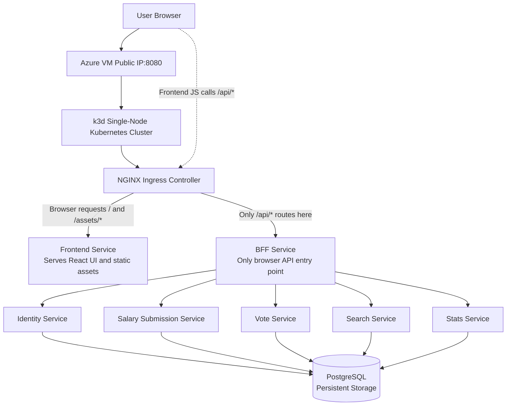

---

## 2. Kubernetes Namespace Diagram

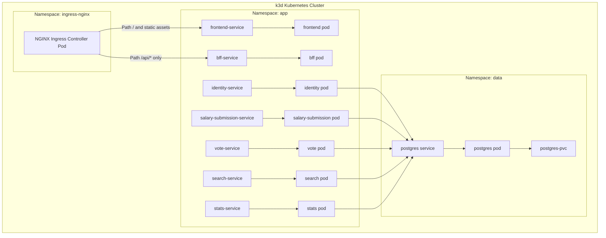

---

## 3. Ingress and Network Routing Diagram

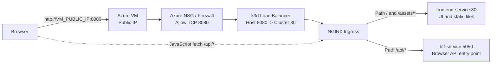

---

## 4. Service-to-Pod Mapping Diagram

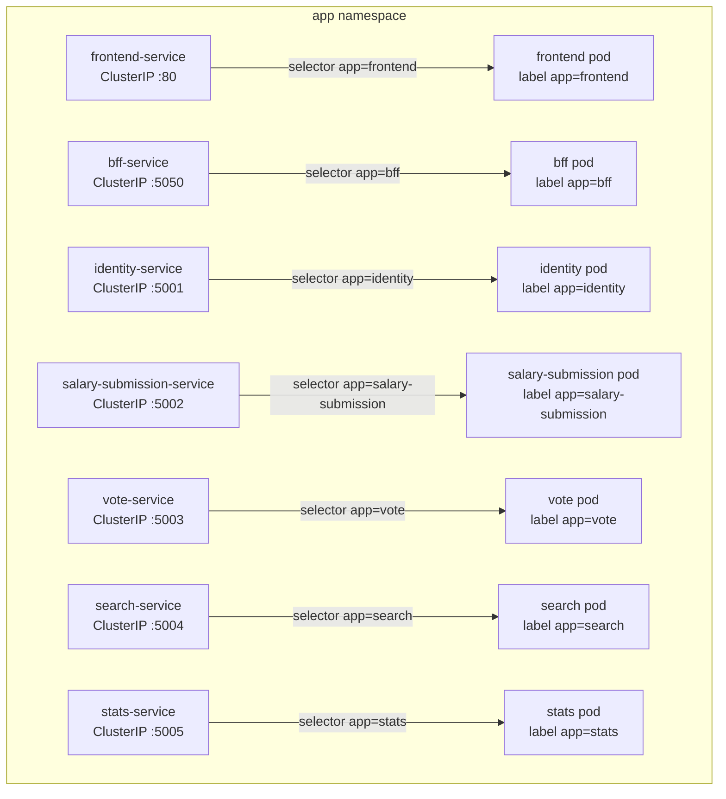

---

## 5. Pod Count Diagram

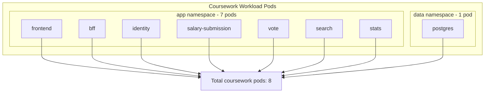

---

## 6. Labels and Selectors Diagram

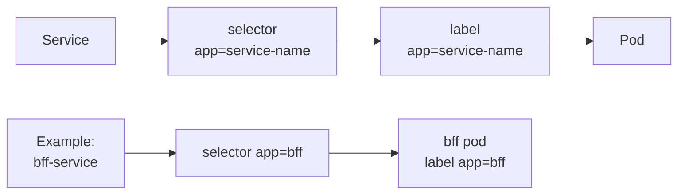

---

## 7. API Request Flow Diagram

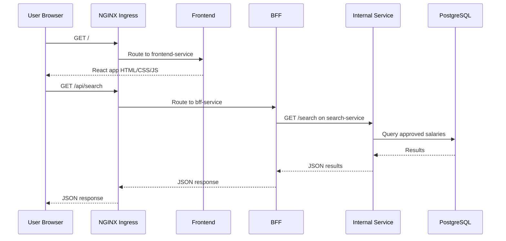

---

## 8. Salary Submission Workflow Diagram

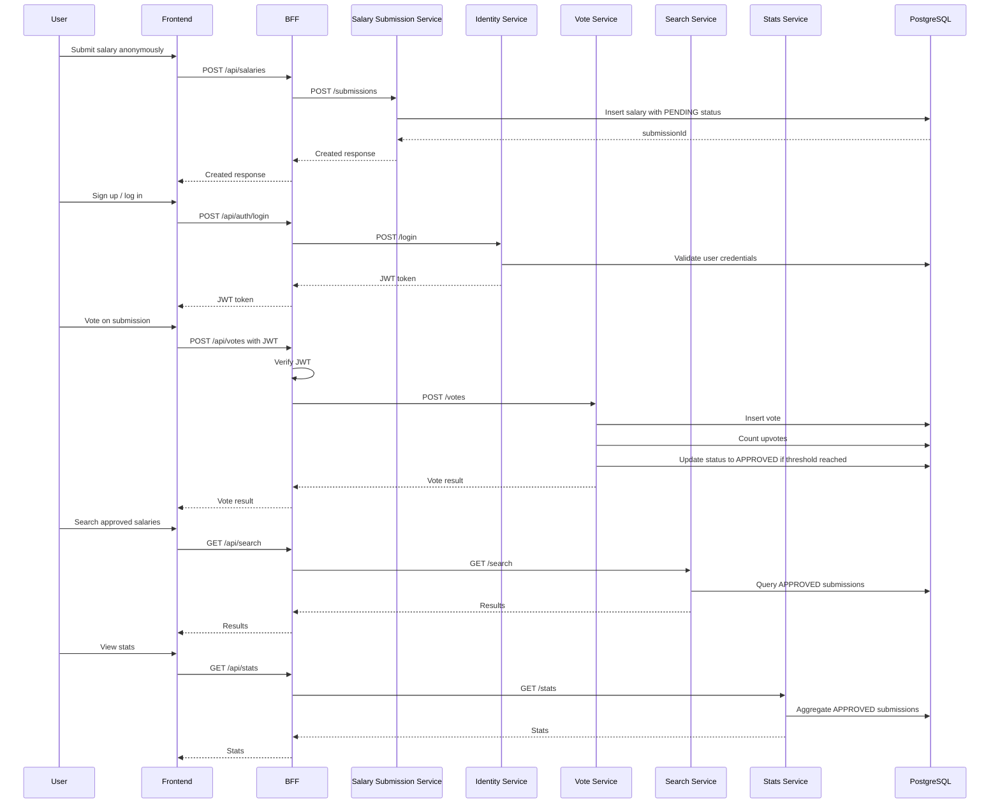

---

## 9. Database Schema Diagram

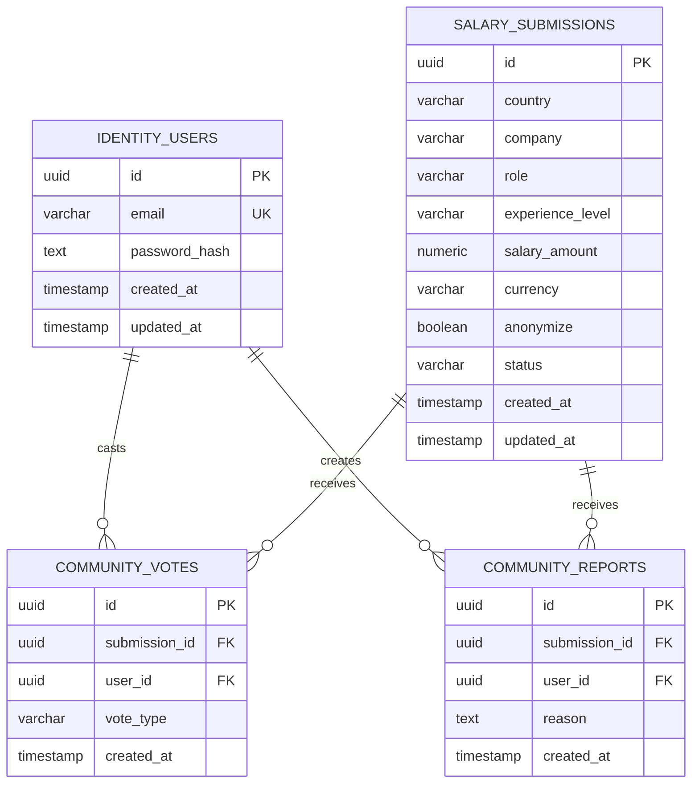

---

## 10. PostgreSQL Storage Diagram

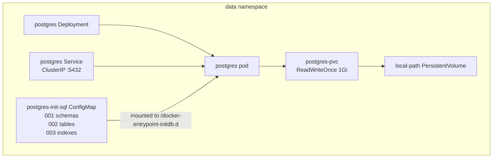

---

## 11. ConfigMap and Secret Wiring Diagram

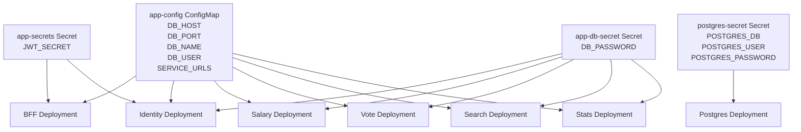

---

## 12. Docker Image Ownership Diagram

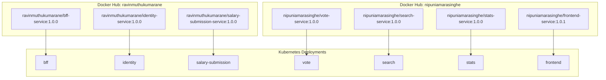

---

## 13. Azure Pipeline CI/CD Diagram

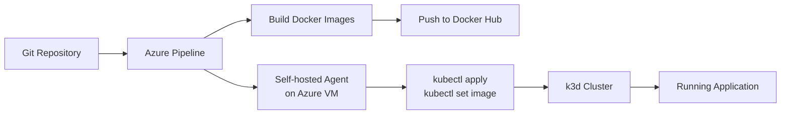

---

## 14. Azure Pipeline Stage Diagram

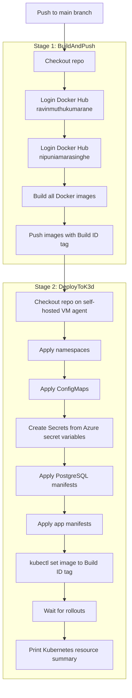

---

## 15. Final Evidence Checklist Diagram

```mermaid
flowchart TB
    evidence[Coursework Evidence]

    cluster[kubectl get nodes]
    namespaces[kubectl get namespaces]
    appPods[kubectl get pods -n app]
    dataPods[kubectl get pods -n data]
    services[kubectl get svc -n app]
    ingress[kubectl get ingress -n app]
    pvc[kubectl get pvc -n data]
    db[psql schemas/tables/indexes]
    browser[Browser screenshot<br/>VM_PUBLIC_IP:8080]
    api[curl /api/search<br/>curl /api/stats]
    pipeline[Azure Pipeline run logs]

    evidence --> cluster
    evidence --> namespaces
    evidence --> appPods
    evidence --> dataPods
    evidence --> services
    evidence --> ingress
    evidence --> pvc
    evidence --> db
    evidence --> browser
    evidence --> api
    evidence --> pipeline
```
